# Diagramme de Cas d'Utilisation - BiblioTech

## Vue d'ensemble

Ce diagramme représente les interactions entre les différents acteurs et les fonctionnalités du système BiblioTech.

```mermaid
graph TD
    U["👤 Utilisateur Ordinaire"]
    B["📚 Bibliothécaire"]
    A["⚙️ Admin"]
    S["🖥️ Système"]

    U -->|Consulter| Catalogue["Consulter le Catalogue"]
    U -->|Voir| Favoris["Voir les Favoris du Bibliothécaire"]
    U -->|S'authentifier| Auth["S'authentifier"]
    
    B -->|Consulter| Catalogue
    B -->|Ajouter| AddFav["Ajouter un Livre aux Favoris"]
    B -->|Retirer| RemFav["Retirer un Livre des Favoris"]
    B -->|Voir| Favoris
    B -->|S'authentifier| Auth
    B -->|Créer| CreateLiv["Créer un Livre"]
    B -->|Modifier| EditLiv["Modifier un Livre"]
    B -->|Supprimer| DelLiv["Supprimer un Livre"]
    B -->|Gérer| CatMgmt["Gérer les Catégories"]
    
    A -->|Accès Total| AdminAccess["Accès Administrateur"]
    AdminAccess --> CreateLiv
    AdminAccess --> EditLiv
    AdminAccess --> DelLiv
    AdminAccess --> CatMgmt
    AdminAccess --> Auth
    AdminAccess --> Catalogue
    
    S -->|Valider| Auth
    S -->|Persister| Database["Base de Données"]
    S -->|Gérer| Session["Sessions Utilisateur"]

    style U fill:#e1f5ff
    style B fill:#f3e5f5
    style A fill:#fff3e0
    style S fill:#f1f8e9
    style Auth fill:#ffebee
    style Catalogue fill:#e3f2fd
    style AddFav fill:#fce4ec
    style RemFav fill:#fce4ec
    style Favoris fill:#e0f2f1
```

## Description des Acteurs

### 👤 Utilisateur Ordinaire (role: `user`)
- **Consulter le Catalogue** : Parcourir l'ensemble des livres disponibles avec recherche et filtrage
- **Voir les Favoris** : Consulter les livres favorisés par les bibliothécaires
- **S'authentifier** : Se connecter/déconnecter du système

### 📚 Bibliothécaire (role: `bibliothécaire`)
- **Toutes les fonctionnalités de l'utilisateur ordinaire**, plus :
- **Ajouter un Livre aux Favoris** : Marquer un livre comme favori personnel
- **Retirer un Livre des Favoris** : Enlever un livre de ses favoris
- **Créer/Modifier/Supprimer des Livres** : Gérer le catalogue
- **Gérer les Catégories** : Créer, modifier, supprimer des catégories

### ⚙️ Admin (role: `admin`)
- **Accès complet** à toutes les fonctionnalités du système
- Gestion complète des utilisateurs (future implémentation)
- Accès aux statistiques avancées

### 🖥️ Système
- **Authentification** : Valide les identifiants et gère les sessions
- **Persistance** : Sauvegarde les données en base de données
- **Gestion des sessions** : Maintient l'état de connexion des utilisateurs

## Cas d'Utilisation Principaux

### Authentification (Séance 4)
- Inscription d'un nouvel utilisateur
- Connexion avec email/password
- Déconnexion sécurisée
- Gestion des sessions

### Gestion du Catalogue (Séance 1-3)
- Consulter la liste des livres
- Voir les détails d'un livre
- Rechercher par titre ou auteur
- Filtrer par catégorie
- (Bibliothécaire) CRUD sur les livres

### Gestion des Favoris (Séance 5)
- **RESTRICTION IMPORTANTE** : Seuls les bibliothécaires peuvent ajouter/retirer des favoris
- Tous les utilisateurs peuvent voir les favoris du bibliothécaire
- Affichage sur la fiche livre et la page d'accueil

## Restrictions et Permissions

| Fonctionnalité | User | Biblio | Admin |
|---|:---:|:---:|:---:|
| Consulter catalogue | ✅ | ✅ | ✅ |
| Voir les favoris | ✅ | ✅ | ✅ |
| Ajouter favoris | ❌ | ✅ | ✅ |
| Retirer favoris | ❌ | ✅ | ✅ |
| Créer livre | ❌ | ✅ | ✅ |
| Modifier livre | ❌ | ✅ | ✅ |
| Supprimer livre | ❌ | ✅ | ✅ |
| Gérer catégories | ❌ | ✅ | ✅ |

## Architecture de Sécurité

1. **Authentification** : Laravel Fortify / Session
2. **Autorisation** : Role-based Access Control (RBAC)
3. **Middleware** : Protection des routes sensibles
4. **CSRF** : Token pour toutes les opérations POST/DELETE
5. **Validation** : Côté serveur pour tous les inputs utilisateur
