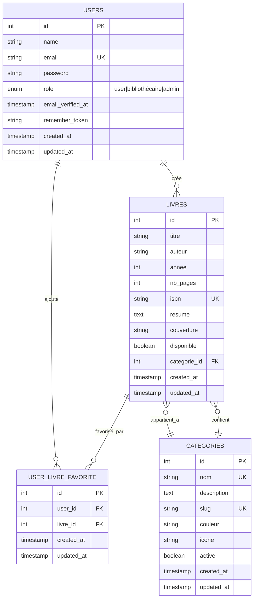

# Schéma du Modèle Relationnel - BiblioTech

## Vue d'ensemble ER (Entity-Relationship)



## Tables Détaillées

### 📋 Table: USERS (Utilisateurs)

**Rôle** : Gérer l'authentification et les rôles des utilisateurs

| Colonne | Type | Contrainte | Description |
|---------|------|-----------|-------------|
| `id` | INT | PK, AI | Identifiant unique |
| `name` | VARCHAR(255) | NOT NULL | Nom de l'utilisateur |
| `email` | VARCHAR(255) | UK, NOT NULL | Email unique pour authentification |
| `password` | VARCHAR(255) | NOT NULL | Mot de passe hashé (bcrypt) |
| `role` | ENUM | NOT NULL, DEFAULT: 'user' | Rôle : `user`, `bibliothécaire`, `admin` |
| `email_verified_at` | TIMESTAMP | NULL | Date de vérification de l'email |
| `remember_token` | VARCHAR(100) | NULL | Token pour "Se souvenir de moi" |
| `created_at` | TIMESTAMP | NOT NULL | Date de création |
| `updated_at` | TIMESTAMP | NOT NULL | Date de dernière modification |

**Indexation** :
- PRIMARY KEY : `id`
- UNIQUE : `email`

---

### 📚 Table: LIVRES (Livres)

**Rôle** : Stocker les informations des livres du catalogue

| Colonne | Type | Contrainte | Description |
|---------|------|-----------|-------------|
| `id` | INT | PK, AI | Identifiant unique |
| `titre` | VARCHAR(255) | NOT NULL | Titre du livre |
| `auteur` | VARCHAR(255) | NOT NULL | Nom de l'auteur |
| `annee` | INT | NOT NULL | Année de publication |
| `nb_pages` | INT | NOT NULL | Nombre de pages |
| `isbn` | VARCHAR(20) | UK, NOT NULL | ISBN unique du livre |
| `resume` | TEXT | NULL | Résumé/Description du livre |
| `couverture` | VARCHAR(255) | NULL | Chemin vers l'image de couverture |
| `disponible` | BOOLEAN | NOT NULL, DEFAULT: true | Statut de disponibilité |
| `categorie_id` | INT | FK, NOT NULL | Référence à la catégorie |
| `created_at` | TIMESTAMP | NOT NULL | Date de création |
| `updated_at` | TIMESTAMP | NOT NULL | Date de dernière modification |

**Indexation** :
- PRIMARY KEY : `id`
- UNIQUE : `isbn`
- FOREIGN KEY : `categorie_id` → CATEGORIES(id) ON DELETE CASCADE

---

### 🏷️ Table: CATEGORIES (Catégories)

**Rôle** : Organiser les livres par catégories

| Colonne | Type | Contrainte | Description |
|---------|------|-----------|-------------|
| `id` | INT | PK, AI | Identifiant unique |
| `nom` | VARCHAR(100) | UK, NOT NULL | Nom de la catégorie (ex: "Fantasy") |
| `description` | TEXT | NULL | Description détaillée |
| `slug` | VARCHAR(100) | UK, NOT NULL | Slug pour l'URL (ex: "fantasy") |
| `couleur` | VARCHAR(7) | NOT NULL | Couleur hexadécimale (#FFC300) |
| `icone` | VARCHAR(50) | NOT NULL | Classe Font Awesome (fas fa-star) |
| `active` | BOOLEAN | NOT NULL, DEFAULT: true | Catégorie visible ou cachée |
| `created_at` | TIMESTAMP | NOT NULL | Date de création |
| `updated_at` | TIMESTAMP | NOT NULL | Date de dernière modification |

**Indexation** :
- PRIMARY KEY : `id`
- UNIQUE : `nom`, `slug`

---

### ❤️ Table: USER_LIVRE_FAVORITE (Favoris - Pivot)

**Rôle** : Relation many-to-many entre utilisateurs et livres favoris

| Colonne | Type | Contrainte | Description |
|---------|------|-----------|-------------|
| `id` | INT | PK, AI | Identifiant unique |
| `user_id` | INT | FK, NOT NULL | Référence à l'utilisateur |
| `livre_id` | INT | FK, NOT NULL | Référence au livre |
| `created_at` | TIMESTAMP | NOT NULL | Date d'ajout du favori |
| `updated_at` | TIMESTAMP | NOT NULL | Date de dernière modification |

**Indexation** :
- PRIMARY KEY : `id`
- COMPOSITE UNIQUE : `(user_id, livre_id)` → Évite les doublons
- FOREIGN KEY : `user_id` → USERS(id) ON DELETE CASCADE
- FOREIGN KEY : `livre_id` → LIVRES(id) ON DELETE CASCADE

---

## Relations Eloquent

### User Model
```php
// Un utilisateur peut avoir plusieurs favoris
public function favoriteBooks()
{
    return $this->belongsToMany(
        Livre::class,
        'user_livre_favorite',
        'user_id',
        'livre_id'
    )->withTimestamps();
}
```

### Livre Model
```php
// Un livre peut être favori de plusieurs utilisateurs
public function favoritedByUsers()
{
    return $this->belongsToMany(
        User::class,
        'user_livre_favorite',
        'livre_id',
        'user_id'
    )->withTimestamps();
}

// Un livre appartient à une catégorie
public function categorie()
{
    return $this->belongsTo(Categorie::class, 'categorie_id');
}

// Vérifier si un livre est favori pour un utilisateur
public function isFavoriteFor(?User $user = null)
{
    if (is_null($user)) {
        return false;
    }
    return $this->favoritedByUsers()->where('users.id', $user->id)->exists();
}
```

### Categorie Model
```php
// Une catégorie contient plusieurs livres
public function livres()
{
    return $this->hasMany(Livre::class, 'categorie_id');
}
```

---

## Intégrité Référentielle

### Cascades `ON DELETE`
- **USERS** supprimé → Tous ses favoris (`USER_LIVRE_FAVORITE`) sont supprimés
- **LIVRES** supprimé → Tous ses favoris sont supprimés (on perd les associations)
- **CATEGORIES** supprimé → Les livres de cette catégorie sont aussi supprimés

### Contraintes Uniques
- **Email** dans USERS → Empêche les doublons d'email
- **ISBN** dans LIVRES → Code unique par livre
- **(user_id, livre_id)** dans USER_LIVRE_FAVORITE → Un utilisateur ne peut favoriser un livre qu'une fois

### Valeurs par Défaut
- **USERS.role** = `'user'`
- **LIVRES.disponible** = `true`
- **CATEGORIES.active** = `true`

---

## Migrations Associées

1. **2014_10_12_000000_create_users_table.php** - Création table USERS
2. **2025_01_01_000000_create_categories_table.php** - Création table CATEGORIES
3. **2025_01_01_000001_create_livres_table.php** - Création table LIVRES avec FK
4. **2026_03_03_000000_add_role_to_users_table.php** - Ajout colonne role
5. **2026_03_09_create_user_livre_favorite_table.php** - Table pivot FAVORIS

---

## Exemple de Requêtes Communes

### Récupérer les favoris d'un utilisateur
```php
$user = User::find(1);
$favoris = $user->favoriteBooks()->with('categorie')->get();
```

### Compter les bibliothécaires qui ont mis un livre en favori
```php
$livre = Livre::find(1);
$count = $livre->favoritedByUsers()
    ->where('role', '=', 'bibliothécaire')
    ->count();
```

### Récupérer les 6 livres les plus favorisés
```php
$livresFavoris = Livre::with('categorie', 'favoritedByUsers')
    ->whereHas('favoritedByUsers', function ($query) {
        $query->where('role', '=', 'bibliothécaire');
    })
    ->withCount(['favoritedByUsers as favoris_count' => function ($query) {
        $query->where('role', '=', 'bibliothécaire');
    }])
    ->orderBy('favoris_count', 'desc')
    ->take(6)
    ->get();
```

### Ajouter un livre aux favoris
```php
$user->favoriteBooks()->attach($livre->id);
```

### Retirer un livre des favoris
```php
$user->favoriteBooks()->detach($livre->id);
```
